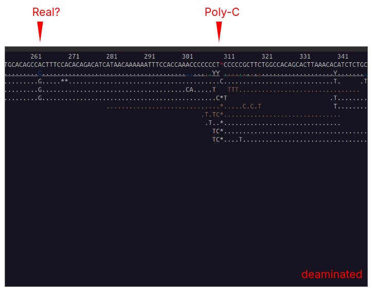
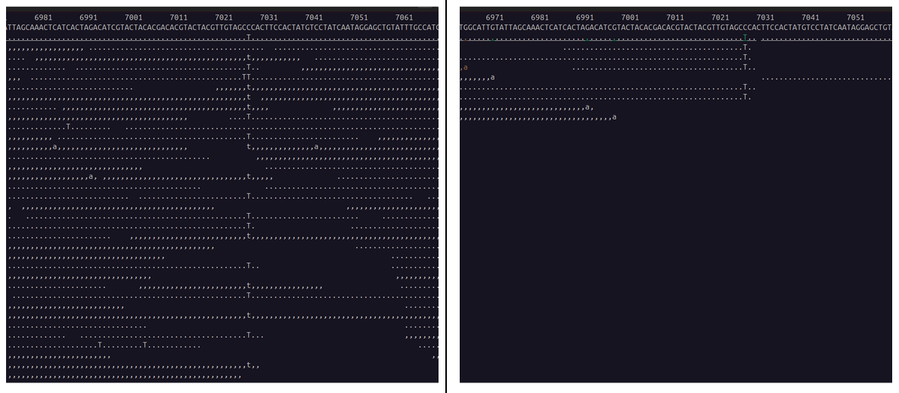

# ALPHABET
**AL**PHABET **p**rovides **ha**plogroup **b**ranch **e**s**t**imates

ALPHABET is a tool for the detection of mtDNA haplogroup-branches in low coverage or highly contaminated ancient DNA samples. It uses the PhyloTree 17 phylogeny to provide coverage-statistics for each haplogroup-node to find the haplogroup branch(es) with the highest support.

ALPHABET attempts to find the _branches_ with the highest support, it is _not_ a haplogroup caller!

## Requirements

- singularity
- nextflow v22.10 (or larger)

## Usage

The input for ALPHABET is a folder with BAM-files. These BAM-files should contain human mtDNA sequences (e.g. the Hominidae 'Extracted Reads' provided by the [quicksand](https://github.com/mpieva/quicksand) pipeline).

ALPHABET maps these sequences to the RSRS, extracts deaminated sequences (based on C-to-T damage) and creates summary statistics for each Haplogroup-Node in the PhyloTree 17 release (see workflow section below).

### flags

```
--split              DIR     Directory containing BAM-files with human mtDNA sequences
--penalty_range      N       In the 'best' tree, include all nodes with the lowest N penalty-values (default: 2)
--include_deduped            Set this flag to create haplogroup-statistics also for Deduped sequences (default: off) 
```

### quickstart

(Work in Progress)

## Output files

The alphabet output tells you which parts of the mtDNA haplogroup phylogeny are most compatible with the data, and why. It produces three files for each input-file (NAME) (in `out/06_haplogroups/`):

1. Full table for each node in the tree (`NAME.raw.tsv`)
2. Filtered table, showing the path to haplogroups with the lowest penalty (`NAME.best.tsv`)

`final_report.tsv`
A report that contains summary stats for the 'best' node in the tree for all analyzed files

### For each analyzed file

`NAME.raw.tsv`
Full table containing coverage statistics for all haplogroup nodes in PhyloTree 17 (unfiltered).

`NAME.best.tsv`
Filtered table showing the nodes(s) in the tree with the lowest penalty (+ `penalty_range`), representing the best-supported haplogroup branch.

### Column description

- **Order**: Incrementing index reflecting the original row order in the table.
- **Parent**: The immediate parent haplogroup of the node (useful for custom parsing or tree reconstruction).
- **PhyloTree:** The haplogroup path as defined in PhyloTree 17.
- **Penalty:** Score used to find the `best` nodes. Lower values show better supported branches. Calculated as `SumOfGaps` + `TotalMismatch` + `DistanceToBest` 
- **RequiredGaps:** Number of intermediate haplogroup nodes skipped **since the last supported node** on the branch.
- **SumOfGaps:** Total number of skipped intermediate haplogroup nodes along the entire branch from the root to this node.
- **BranchSupport:** Accumulated number of supported haplogroup-defining positions along the branch. 
- **TotalMismatch:** Absolute number of mismatches along the branch (covered diagnostic positions minus supported positions). Used to calculate Penalty.
- **DistanceToBest:** The maximum number of supported positions observed in any branch minus the number of supported positions accumulated up to this node. Indicates missing unexplained variation in the branch and is used to calculate the Penalty. 
- **BranchSupportPercent:** Accumulated branch support (as percentage).
- **PositionSupport:** The number for haplogroup-defining positions that are covered by sequences and share the required state (see 'ReadCoverage')
- **SequenceSupport:** Coverage support for each _diagnostic position_. Shows the number of sequences covering that position and support the diagnostic state.

## Workflow

### 1. Mapping with BWA

Files are (re-)mapped to the RSRS (Reconstructed Sapiens Reference Sequence) with *BWA* and saved to `out/01_bwa/`

### 2. Filter Alignment
Files are filtered for minimum mapping quality (25) and minimum length (35). Then the alignment is sorted using *samtools*

### 3. Duplicate Removal

PCR duplicates are removed with *bam-rmdup* and saved to `out/02_uniq/`

### 4. Remove Poly-C Stretches

Sequences are removed from the alignment that overlap low-complexity poly-c stretches (positions 303-315, 513-576, 3565-3576 and 16184-16193) with *bedtools intersect*. These poly-c stretches can introduce face C-to-T deamination patterns, e.g.: .

The filtered alignment is saved to `out/03_bedfilter/`

### 5. Mask variable positions 

Variable positions can cause C-to-T differences in the first and last 3 bases because of haplogroup differences, rather than DNA damage. Example: 

Positions in the alignment are masked if the majority of sequences (but at least 2 sequences) shows a differenct base than the reference.

The pileup and the extracted positions are saved to `out/04_pileup/`. The positions are only masked for the extraction of deaminated sequences.

### 6. Extract deaminated sequences

Sequences are extracted that have a C-to-T substitution in the first or last three bases (unless this subsitution is one of the masked positions). Deaminated sequences are saved to `05_deaminated/`

### 7. Mask first and last three bases 

Set the mapping quality score of the first and last three T-bases of all deaminated sequences to 0. They are ignored in the phylotree-analysis

### 8. Haplogroup Statistics

Walk through the PhyloTree-file and create summary statistics for each haplogroup node. The resulting tables are saved to   `06_haplogroups/`

# Resources
## Human mtDNA Haplogroups

This repository includes the RSRS-based PhyloTree17 XML-file provided under MIT License by the [Institute of Genetic Epidemiology, Insbruck](https://github.com/genepi/phylotree-rsrs-17/blob/main/src/tree.xml)

## Neanderthal mtDNA Haplogroups
Neanderthal mtDNA Haplogroups are added to the PhyloTree XML file. The Nomenclature and diagnostic positions follow [Andreeva et al. 2022](https://www.nature.com/articles/s41598-022-16164-9)

I moved positions from the Neanderthal "Eve" that are shared with Sima and Denisovans into the NA'SIMA'DEN group  

<pre>
NA'SIMA'DEN                                          Neanderthal, Sima and Denisovan (difference to RSRS)
+-- NA                                               Neanderthal-Eve
    |-- NA1                                          Hohenstein-Stadel (HST)
    +-- NA2
        |-- NE                                       Early Neanderthal Clades (Altai, Denisova15)
        +-- NA2a
            |-- NM                                   Middle Neanderthal Clades
            |   |-- NM1                                  Forbes Quarry
            |   |   +-- NM1a                             Stajnija S5000
            |   +-- NM2                                  Mezmaiskaya 3
            +-- NL                                   Late Neanderthal Clades (Chagyrskaya, Denisova11)
                |-- NL2                                  Les Cottes Z4-1514
                +-- NL1                                  El Sidron, Feldhofer2
                    +-- NL1a
                        |-- NL1a1                        Feldhofer 1
                        +-- NL1a2
                            |-- NL1a2a                   Vindija 33.16
                            +-- NL1a2b                   Spy-94a
                                +-- NL1a2b1              Goyet
</pre>

## Sima de los Huesos and Denisovan "Haplogroups"

Diagnostic postitions were extracted, based on sequence consensus between the specified reference genomes 

<pre>
NA'SIMA'DEN                    Neanderthal, Sima and Denisovan (difference to RSRS)
+-- SIMA'DEN                   Shared Sima and Denisova
    |-- SIMA                   Sima de los Huesos (NC_023100.1)
    +-- DEN                    Denisovans
        |-- DEN3'4             Denisova 3 (NC_013993.1) and Denisova 4 (FR695060.1)
        +-- DEN2'8             Denisova 2 (KX663333.1) and Denisova 8 (KT780370.1)
</pre>